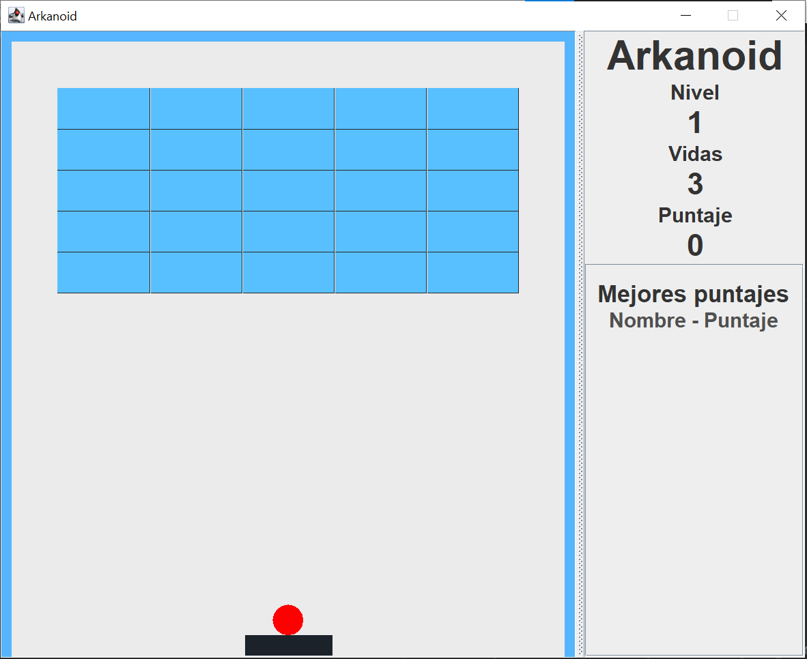
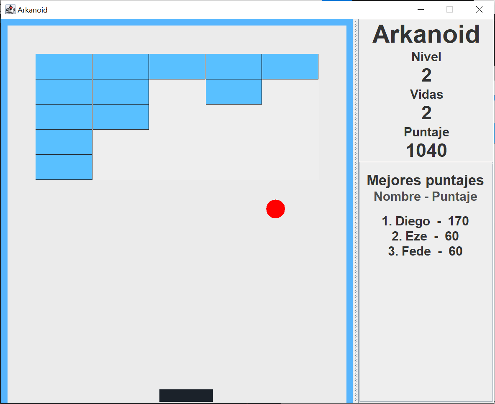

# TPO Intro a la Orientacion a Objetos - Arkanoid

## Enunciado

El equipo de analistas ha finalizado el relevamiento y para un juego similar al “Arkanoid”. Se solicita que se modele e implemente el juego relevado con la información detallada según el relevamiento realizado.

- El juego consiste en ir destruyendo paredes de ladrillos con una bola que rebota, de manera que cuando la bola toca un ladrillo este desaparece y causa un rebote de la bola.
- Además de los elementos mencionados, el jugador controla una barra horizontal que puede desplazar por la parte inferior para hacer rebotar la bola y volverla a lanzar sobre los ladrillos.
- El juego consta de un bloque de 25 ladrillos (5 x 5) que deben ser destruidos en su totalidad para pasar de nivel. Al pasar de nivel el juego repone los 25 ladrillos y aumenta la velocidad de la bola.
- Por cada ladrillo destruido de la primera fila se obtienen 10 puntos, por cada ladrillo de la segunda 20, por los de la tercera 30 por los de la cuarta 40 y por los de la quinta 50 (la primera fila es la fila inferior del bloque). Por cada 1000 puntos se obtiene una vida.
- El juego inicia con la bola posicionada sobre la barra del jugador y con 3 vidas. Las mismas se irán incrementando a lo largo del juego.
- El inicio del juego será presionando la barra espaciadora (hasta que esto no ocurra la bola quedará sobre la barra) y el jugador controla la barra con las teclas de derecha e izquierda del teclado.
- Los rebotes de la bola cuando tocan un ladrillo y los destruyen se realizan en un ángulo aleatorio entre 85 y 95 grados.
- Los rebotes de la bola cuando tocan la barra dependen de la porción de la barra sobre la que impactan, si impactan sobre la mitad izquierda de la barra el ángulo será de 90 mas del ángulo de entrada, si impacta en la mitad de la derecha el ángulo será de 60 más el ángulo de entrada.
- Si el jugador no llegara a alcanzar la bola cuando llega a la línea de movimiento de la barra, pierde una vida.
- Se debe llevar un registro de los puntos obtenidos por los 20 mejores jugadores, de manera que, si al finalizar el juego el puntaje merece ser incluido en ese ranking, se le debe pedir al jugador que ingrese el nombre.
- El juego finaliza cuando no queden más vidas. El juego puede ser pausado a requerimiento del jugador, el mismo se reiniciará por medio de la barra espaciadora.

## Estrategia

Es un programa realizado en __Java 11__ con utilizando la libreria de __Java Swing__ para los componentes de la UI.

## Resultado

## Integrantes

- [Barrena, Ezequiel](https://github.com/ezebarrena)
- [Gewisgold, Federico](https://github.com/Fedegewis)
- [Sánchez Paredes, Diego Andrés](https://github.com/diegoasanch)
